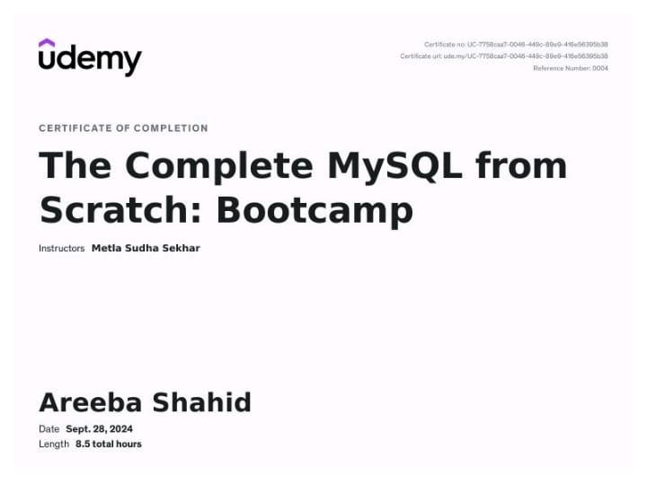

# The Complete MySQL from Scratch: Bootcamp

## 🏆 Certificate of Completion
**Course:** The Complete MySQL from Scratch: Bootcamp  
**Instructor:** Metla Sudha Sekhar  
**Platform:** Udemy  
**Date Completed:** September 28, 2024  
**Duration:** 8.5 total hours  
**Certified To:** Areeba Shahid

---

## 🧠 What I Learned

This course covered foundational to intermediate topics in MySQL, including:

- Setting up MySQL and connecting to a database
- Creating and managing databases and tables
- Performing CRUD operations (Create, Read, Update, Delete)
- Filtering, sorting, and joining tables
- Using aggregate functions and subqueries
- Understanding indexes, views, and stored procedures
- Implementing best practices for database management

---

## 🛠️ Technologies Used

- **MySQL**
- **SQL Workbench**
- **Command Line Interface (CLI)**

---

## 📁 Repository Purpose

This repository serves as a personal record of my course completion and knowledge gained from the **MySQL Bootcamp** on Udemy. It also includes:

- Notes and key takeaways
- Practice queries
- Example projects (if applicable)

Feel free to explore or fork if you're also learning MySQL!

---

## 📜 License

This project is for educational purposes only. All course content belongs to its rightful owners.
